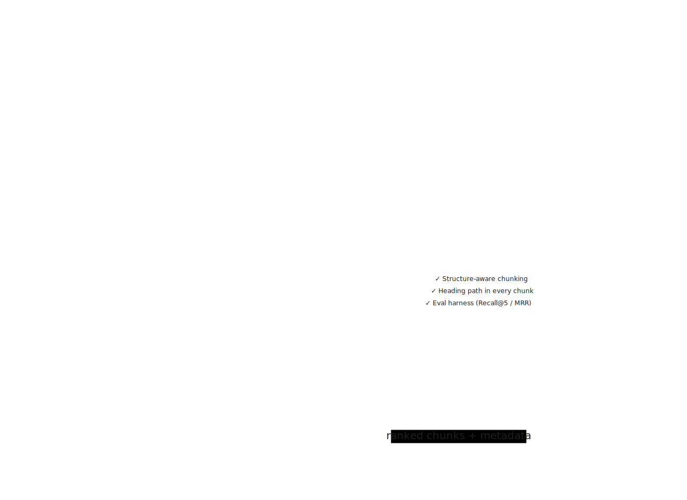
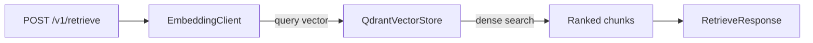
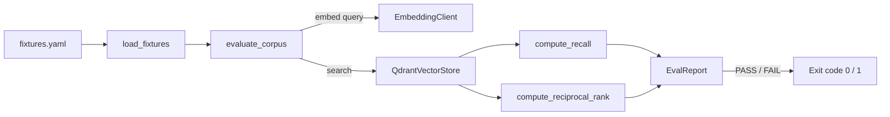
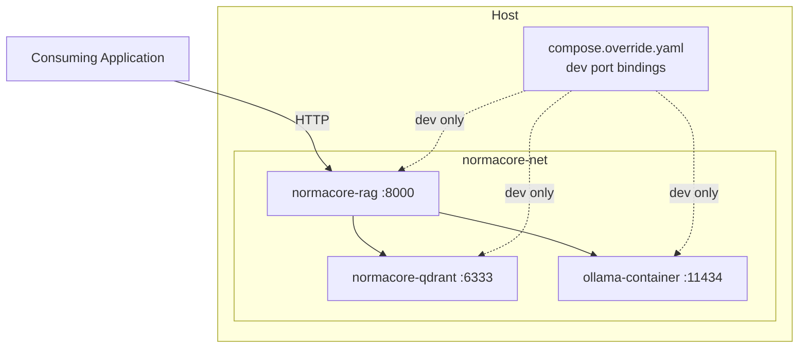

# Architecture

This page describes the system components, data flow, and deployment model.

For the full rationale behind each decision, see the ADRs in the source code.

## System overview

NormaCore is split into three concerns: ingestion, retrieval, and evaluation.
The API is the only externally visible surface. Consuming applications never
touch the vector store or embedding service directly.



## Ingestion pipeline

Documents are ingested at build time via `POST /v1/ingest` or `make ingest`.
The pipeline is format-aware at the reader layer and format-agnostic
everywhere else.

### Reader layer

Each format-specific reader produces a `DocumentSection` — a
format-agnostic intermediate representation carrying:

- `section_id` — clause identifier extracted from heading text or generated
  positionally
- `heading_path` — full ancestor heading list from root to current section
- `heading_level` — depth in the document hierarchy
- `text` — body text of the section
- `metadata` — corpus_id, source name, and any caller-supplied fields

All readers are in `src/normacore/ingestion/readers/`. Adding a new format
means implementing a reader that produces `DocumentSection` objects — the
chunker and everything downstream requires no changes.

### Chunker

The chunker converts `DocumentSection` objects into embeddable `Chunk`
objects using this strategy in order:

1. **Glossary detection** — sections matching `**term**: definition` are
   kept atomic and never split
2. **Size check** — sections within the 512-token limit become a single chunk
3. **Recursive fallback** — oversized sections split on `\n\n` paragraph
   boundaries, then sentence boundaries, with 15% overlap

Every chunk carries the full heading path as a prefix in its text, making
chunks self-contained for retrieval without semantic or late chunking.

## Retrieval pipeline



The current retrieval is dense-only. Sparse/hybrid RRF retrieval is deferred
to a post-v0.1.0 release — BGE-M3 sparse vectors are not exposed by Ollama,
and the Qdrant native BM25 integration is not yet wired.

## Evaluation harness

The eval harness runs independently of the API. It connects directly to
Qdrant and Ollama via injected localhost URLs and does not go through the
`rag` container.



Metrics:

| Metric   | Threshold | Definition                                    |
|----------|-----------|-----------------------------------------------|
| Recall@5 | ≥ 0.85    | Fraction of expected chunks found in top-5    |
| MRR      | ≥ 0.70    | Mean Reciprocal Rank of first relevant result |

## Deployment model

All services communicate over an internal Docker network. No service port
is exposed to the host in production. The `compose.override.yaml` (generated
by `make setup`) adds host port bindings for development only.



### Topology variants

The topology is controlled entirely by environment variables — no code
changes between deployments.

| Topology             | `QDRANT_URL`                  | `EMBEDDING_BASE_URL`            |
|----------------------|-------------------------------|---------------------------------|
| All-in-one (default) | `http://qdrant:6333`          | `http://ollama-container:11434` |
| Split embedding      | `http://qdrant:6333`          | `http://<remote>:11434`         |
| Fully distributed    | `http://<remote-qdrant>:6333` | `http://<remote>:11434`         |

## Source layout

```sh
src/normacore/
├── config.py              # Environment variable loading
├── logging.py             # Shared logging configuration
├── eval.py                # Evaluation harness and CLI entry point
├── api/
│   └── api.py             # FastAPI app, all /v1/ endpoints
├── ingestion/
│   ├── chunker.py         # Structure-aware chunker
│   ├── ingest.py          # Ingestion orchestrator and CLI entry point
│   └── readers/
│       ├── base.py        # DocumentSection IR dataclass
│       └── markdown.py    # Markdown reader
└── retrieval/
    ├── embedding.py       # Async BGE-M3 embedding client
    └── vector_store.py    # Qdrant vector store implementation
```
